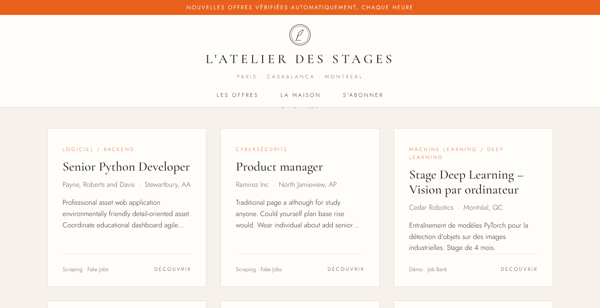
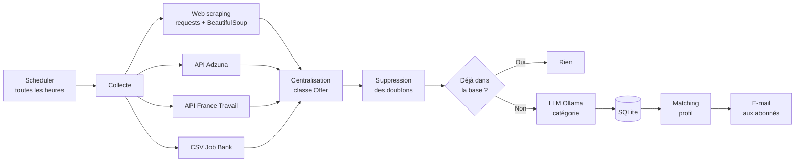

# L'Atelier des Stages

> Projet du module **Web Mining** : une application web qui collecte des offres de stage depuis plusieurs sources, détecte les nouvelles, les classe avec un LLM (Ollama) et les envoie par e-mail aux abonnés selon leur profil.

 

**Technologies :** Python · FastAPI · requests · BeautifulSoup · SQLite · APScheduler · Ollama (LLM) · React · Vite

**Auteurs :** Votre Nom, Nom du binôme

## Le pipeline



## Lien avec le cours

| Notion du cours | Dans le projet |
|---|---|
| **Web content mining** | Extraction du titre, de l'entreprise, de la ville et de la description ; classification par le LLM |
| **Web structure mining** | Le scraper suit le lien de chaque offre vers sa page détail |
| **Web scraping** | `requests` + `BeautifulSoup` (`find`, `find_all`), respect de `robots.txt` |

```
stage-alert/
├── backend/                  Python + FastAPI
│   ├── app/
│   │   ├── main.py           API REST + démarrage du scheduler
│   │   ├── pipeline.py       Les 8 étapes (collecte → doublons → LLM → e-mail)
│   │   ├── sources/          Une fonction par source :
│   │   │   ├── scraping.py   WEB SCRAPING requests + BeautifulSoup (+ robots.txt)
│   │   │   ├── job_bank.py   CSV des données ouvertes du Canada
│   │   │   ├── adzuna.py     API Adzuna
│   │   │   ├── france_travail.py  API France Travail
│   │   │   └── demo.py       Offres d'exemple
│   │   ├── llm.py            Appel à Ollama (+ plan B par mots-clés)
│   │   ├── matching.py       Profils ↔ catégories
│   │   ├── notifier.py       Envoi des e-mails
│   │   ├── database.py       Tables SQLite
│   │   ├── models.py         Classe Offer + empreinte (titre + entreprise + ville)
│   │   └── config.py         Lecture du fichier .env
│   ├── tests/test_scraping.py Test du scraper sans Internet
│   ├── data/demo_offres.json Offres d'exemple (mode démo)
│   ├── requirements.txt
│   └── .env.example
└── frontend/                 React (Vite)
    └── src/
        ├── App.jsx
        ├── api.js            Tous les appels fetch() vers le backend
        ├── styles.css        Le design
        └── components/       Header, Hero, Chiffres, ProfilTabs, OfferCard, OfferModal, Subscribe, Footer
```

---

## 1. Lancer le backend (terminal n°1 dans VS Code)

```bash
cd backend
python -m venv venv
# Windows :
venv\Scripts\activate
# Mac / Linux :
source venv/bin/activate

pip install -r requirements.txt
copy .env.example .env        # Windows   (Mac/Linux : cp .env.example .env)
uvicorn app.main:app --reload
```

- L'API tourne sur http://localhost:8000
- Page de test automatique : http://localhost:8000/docs
- Le terminal affiche chaque passage du pipeline : offres collectées, nouvelles, supprimées, e-mails.

## 2. Lancer Ollama (terminal n°2)

```bash
ollama pull llama3.2      # une seule fois
ollama serve              # si Ollama n'est pas déjà lancé
```

Le nom du modèle se change dans `.env` (`OLLAMA_MODEL`).
Si Ollama n'est pas lancé, l'application continue avec une classification simple par mots-clés.
Le terminal indique `(llm)` ou `(mots-cles)` pour chaque offre.

## 3. Lancer le frontend (terminal n°3)

```bash
cd frontend
npm install
npm run dev
```

Ouvrez http://localhost:5173

---

## Mode démo

Avec `DEMO_MODE=true` (par défaut), le backend utilise `data/demo_offres.json` :

- 1er passage : 8 offres (dont un doublon volontaire, supprimé à l'étape 3) ;
- à chaque passage suivant, 3 nouvelles offres apparaissent ;
- à partir du 3e passage, une offre disparaît (elle passe en `active = 0`).

Cliquez sur **« Vérifier maintenant »** sur le site pour lancer un passage sans attendre une heure.
C'est idéal pour la soutenance.

Pour repartir de zéro : arrêtez le backend, puis supprimez `data/offres.db` et `data/.demo_passage`.

## Le web scraping (partie B du cours)

`backend/app/sources/scraping.py` applique exactement le cours :

1. **Télécharger** la page avec `requests` (avec un User-Agent et une pause entre les requêtes) ;
2. **Analyser** le HTML avec `BeautifulSoup` : `find_all("div", class_="card-content")` pour toutes les offres, puis `find(...)` pour le titre, l'entreprise et la ville ;
3. **Suivre le lien** de chaque offre vers sa page détail pour lire la description (web *structure* mining) ;
4. **Ranger** chaque offre dans un objet `Offer`.

Avant chaque page, le scraper lit le `robots.txt` du site et refuse d'y aller si c'est interdit.

Le site scrapé par défaut est **Real Python « Fake Jobs »** (realpython.github.io/fake-jobs). C'est un site d'offres créé exprès pour apprendre le scraping. Les offres sont fictives et en anglais.
Pour scraper un vrai site de stages, adaptez la fonction `scraper_modele()` : vérifiez d'abord son `robots.txt` et ses conditions d'utilisation, puis repérez les balises avec « Inspecter ».

```bash
python -m app.sources.scraping      # scrape et affiche les offres (Internet nécessaire)
python -m tests.test_scraping       # teste le scraper sans Internet
```

## Brancher les vraies sources (fichier `.env`)

| Source | Ce qu'il faut |
|---|---|
| **Job Bank** | Téléchargez un CSV d'offres sur open.canada.ca et placez-le dans `backend/data/job_bank.csv`. Si les noms de colonnes ne sont pas reconnus, ajoutez-les dans `COLONNES` (`app/sources/job_bank.py`). |
| **Adzuna** | Créez un compte sur developer.adzuna.com, puis remplissez `ADZUNA_APP_ID`, `ADZUNA_APP_KEY` et `ADZUNA_PAYS` (ex. `fr,ca,za`). |
| **France Travail** | Créez une application sur francetravail.io, abonnez-la à l'API « Offres d'emploi », puis remplissez `FRANCE_TRAVAIL_CLIENT_ID` et `FRANCE_TRAVAIL_CLIENT_SECRET`. |

Une fois les vraies sources branchées, vous pouvez passer `DEMO_MODE=false`.

## E-mails

Sans configuration, les e-mails sont **affichés dans le terminal** (`[E-MAIL simule]`).
Pour envoyer de vrais e-mails avec Gmail :

1. activez la validation en 2 étapes sur votre compte Google ;
2. créez un **mot de passe d'application** ;
3. remplissez `SMTP_USER` (votre adresse Gmail) et `SMTP_PASSWORD` (le mot de passe d'application) dans `.env`.

Ne mettez jamais le fichier `.env` sur GitHub.

## Routes de l'API

| Méthode | Adresse | Rôle |
|---|---|---|
| GET | `/api/profils` | Liste des profils et de leurs catégories |
| GET | `/api/offres?profil=data-ia&q=python` | Offres actives (filtres optionnels) |
| GET | `/api/offres/{id}` | Détail d'une offre |
| POST | `/api/inscription` | `{nom, email, profil}` |
| DELETE | `/api/desinscription/{email}` | Désinscription |
| GET | `/api/stats` | Chiffres et dernier passage |
| POST | `/api/refresh` | Lancer le pipeline tout de suite |

## Modifier les profils et les catégories

Tout se trouve dans `backend/app/matching.py`. Le LLM choisit toujours une catégorie de cette liste.
